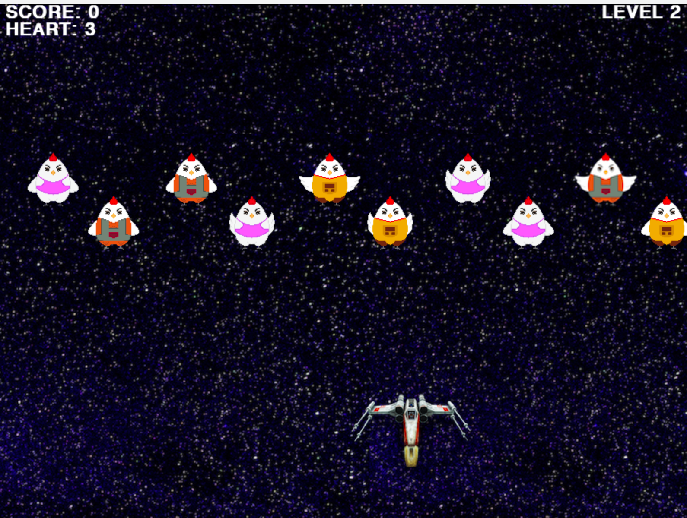

# Chicken Invaders
Chicken Invaders is a series of shoot 'em up video games inspired by a Greek indie developer Konstantinos Prouskas. 

- Framework: Pygame 
- Programming Language: Python

<p align="center">
  
</p>

## Folder Structure ##
```
.
├── Image
│   ├── Background
│   ├── Object
│   └── button
├── LICENSE
├── README.md
├── Sound
├── chicken.py
├── config.py
├── game.py
├── main.py
├── plane.py
└── util.py

6 directories, 87 files
```
## Getting started
```
python main.py
```
